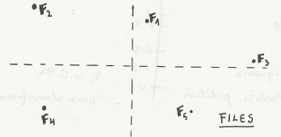
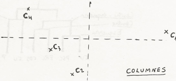
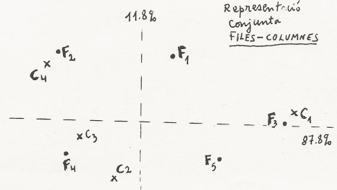
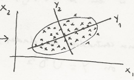

```{r setup, include=FALSE}
knitr::opts_chunk$set(echo = TRUE)
```


Es una técnica útil para representar tables cruades de frecuencia (*tabla de contingencia*):

Partiendo de: $\\ \\$
$f_{i.} = \sum^{n}_{h=1} f_{ih} \quad  \quad f_{.j} = \sum^{k}_{h=1} f_{hj} \\$
$\\$
$N = \sum_{i,j} f_{ij}  \quad  \quad F = (fij)$

|    |   |   |   |COLUMNES|   |   |   |   |
|:----:|:---:|:---:|:---:|:---:|:---:|:---:|:---:|:---:|   
|     |              | |                 |                 |          |                  | |              |  
|     |              | |$\mathbf{C_1}$   | $\mathbf{C_2}$  | $\cdots$ | $\mathbf{C_n}$   | |              |
|     |              | |                 |                 |                             | |              |
|     |$\mathbf{F_1}$| |$f_{11}$         | $f_{12}$        | $\cdots$ | $f_{1n}$         | |$\mathbf{f_1}$|
|     |$\mathbf{F_2}$| |$f_{21}$         | $f_{22}$        | $\cdots$ | $f_{2n}$         | |$\mathbf{f_2}$|
|FILES|$\vdots$      | |$\cdots$         | $\cdots$        | $\cdots$ | $\cdots$         | |$\vdots$      |
|     |$\mathbf{F_k}$| |$f_{k1}$         | $f_{k2}$        | $\cdots$ | $f_{kn}$         | |$\mathbf{f_k}$|
|     |              | |                 |                 |          |                  | |              |    
|     |              | |$\mathbf{f_{.1}}$|$\mathbf{f_{.2}}$| $\cdots$ | $\mathbf{f_{.n}}$| |$\mathbf{N}$  |


$$
\text{LLamaremos:} \qquad D_k = diag(f_{1.},\cdots,f_{k.}) \quad y \quad D_n = diag(f_{.1}, \cdots, f_{.n}) 
$$
Con tal de representar las filas $F_1, F_2, \cdots, F_k$ se define la distancia $\chi²$ entre **filas**:
$$
d²(F_i,F_{i'}) = \sum^{n}_{j=1} \frac{1}{f_{.j}} \Big(\frac{f_{ij}}{f_{i.}}-\frac{f_{i'j}}{f_{i'.}}\Big)^2 = \sum^{n}_{j=1} \Big(\frac{f_{ij}}{\sqrt{{f_{.j}}}\space{{f_{i.}}}} - \frac{f_{i'j}}{\sqrt{{f_{.j}}}\space{{f_{i'}}}}\Big)^2 
$$

Entonces, considerando la matriz $k \times n$:
$$
X= \left( \frac{f_{ij}}{\sqrt{{f_{.j}}}\space{{f_{i.}}}} \right)
$$

Tenemos que aplicar un **análisis de componentes principales** para representar sus filas (*veáse aplicación* $2$, *pàg. AB-29*). 
Análogamente, se define la distancia $\chi^2$ entre **columnes**:
$$
d²(C_j,C_{j'}) = \sum^{k}_{i=1} \frac{1}{f_{i.}} \Big(\frac{f_{ij}}{f_{.j}}-\frac{f_{ij'}}{f_{.j'}}\Big)^2 = \sum^{k}_{j=1} \Big(\frac{f_{ij}}{\sqrt{{f_{i.}}}\space{{f_{.j}}}} - \frac{f_{ij'}}{\sqrt{{f_{i.}}}\space{{f_{.j'}}}}\Big)^2 
$$
y se hace la representación de las columnas de la matriz
$$
\tilde{X}= \Bigg(\frac{f_{ij}}{{{f_{.j}}}\space{\sqrt{f_{i.}}}}\Bigg) \qquad\qquad \text{es decir, de las filas de } \tilde{X} \text{ que es una matriz } n \times k
$$
Con todo esto, obtenemos dos representaciones:

{size=50%} $\\$

 $\\$

{size=50%} $\\$
 $\\$

$\\$El **vector de medias** de la matriz $X = \Bigg(\frac{f_{ij}}{\sqrt{f{.j}} f{i.}} \Bigg)$ es:
$$
\overline{X} = (\sqrt {f_{.1}},..., \sqrt{f_{.n}})
$$
y la **matriz de covarianzas** es $C_n = X'\cdot D_k \cdot X - \overline{X}'\cdot \overline{X}$
siendo, como ya hemos dicho, $D_k = diag(f_{1.},\cdots,f_{k.})$. Es fácil ver que solo hace falta diagonalizar $X'\cdot D_k \cdot X = T \cdot D_{\lambda} \cdot T'$, donde $T$ contiene los **vectores propios** y $D_{\lambda} = diag(\lambda_1,\cdots,\lambda_n)$ contiene los **valores propios**, los cuales cumplen $\lambda_1 = 1 \geq \lambda_2 \geq \cdots \geq \lambda_n \geq 0$. Las coordenadas de las *filas* son las *columnas* de la matriz $ A = XT$, pero la primera columna se omite (debido a que el valor propio $\lambda = 1$ de $X'\cdot D_k \cdot X$ corresponde al valor propio $\lambda = 0$ de $C_n$ y, por tanto, no explica ninguna variabilidad). $\\$
$\\$
Análogamente, consideramos $\check{X'} \cdot D_k \cdot \check{X} = \check{T} \cdot D_{\lambda} \cdot \check{T'}$ i las coordenadas de las *columnas* son las columnas de $B = \tilde{X'} \cdot \tilde{T}$, pero solo consideramos a partir de la segunda. El porcentaje de variabilidad explicado por los ejes $2$ y $3$ es $= 100[\frac{(\lambda_2 +\lambda_3)}{(\lambda_2+\cdots+\lambda_n)}]$

### REPRESENTACIÓN CONJUNTA

Las dos representaciones de filas y columnas están relacionadas; se cumplen las siguientes relaciones entre $A$ y $B$:
$$
A = {D_k}^{-1} F B {D_\lambda}^{-1/2} \qquad \quad B = {D_n}^{-1} F' A {D_\lambda}^{-1/2}
$$

Las coordenadas (segunda y tercera) de la columna $C_j$ cumplen :
$$
(b_{j2},b_{j3}) = \frac{f_{1j}}{f_{.j}} ({a}_{12}^*,{a}_{13}^*) + \cdots + \frac{f_{kj}}{f_{.j}} ({a}_{k2}^*,{a}_{k3}^*)
$$
(siendo ${a}_{ih}^* = {a}_{ih} / \sqrt\lambda_{\nu}$ ) i por tanto son una **media** ponderada respecto a las frecuencias relativas $f_r (F_i / C_j) = \frac{f_{ij}}{f_{.j}}, \space i = 1,\cdots,k$) de las coordenadas (segona y tercera) de las "filas".

| FUMADORES           |     |        |        |        |        |     |      |
|---------------------|-----|--------|--------|--------|--------|-----|------|
|                     |     | No     | Flojo  | Medio  | Fuerte |     |      |
|=====================|-----|--------|--------|--------|--------|-----|------|
|                     |     |$C_1$   |$C_2$   |$C_3$   |$C_4$   |     |      |
| Directivos _senior_ |$F_1$|4       |2       |3       |2       |11   |$f_1$ |
| Directivos _junior_ |$F_2$|4       |3       |7       |4       |18   |$f_2$ |
| Empleados _senior_  |$F_3$|25      |10      |12      |4       |51   |$f_3$ |
| Empleados _junior_  |$F_4$|18      |24      |33      |13      |88   |$f_4$ |
| Secretarios         |$F_5$|10      |6       |7       |2       |25   |$f_5$ |
|                     |     |61      |102     |64      |25      |N =19|      |
|                     |     |$f_{.1}$|$f_{.2}$|$f_{.3}$|$f_{.4}$|     |      |

{size=50%}


### ANÁLISIS DE COMPONENTES PRINCIPALES
##### Definición :
Dadas $n$ variables aleatorias observables $x_1,x_2,\cdots,x_n$, las componentes principales son $n$ variables compuestas:
$$
Y_1 = t_{11}x_1+\cdots + t_{n1}x_n,\cdots, Y_2 = t_{1n}x_1 + \cdots + t_{nn}x_n
$$
tales que (condicionado a la restricción $\sum^n_{h=1} {t_{hi}}^2 = 1$):

1) Están incorrelacionadas dos a dos: $\\$
  $corr(Y_i,Y_j) = 0 \qquad i \not= j = 1, \cdots, n$
2) Las variancias son respectivamente máximas: $\\$
  $var(Y_1) =  \lambda_1 \geq var(Y_2) = \lambda_2 \geq \cdots \geq var(Y_n) = \lambda_n$

**Caso particular n = 2:**
\begin{equation}
x_1 ; x_2 \\ 
Y_1 = t_{11}x_1 + t_{21}x_2 \\ 
Y_2 = t_{12}x_1 + t_{22}x_2 \\ 
var(Y_1) = \lambda_1 \geq var(Y_2) = \lambda_2 \\ 
\begin{pmatrix}
t_{11} & t_{12} \\
t_{12} & t_{22} 
\end{pmatrix}
\end{equation}
**verifica**:
$$
 T\cdot T' = I_2
$$

#### OBTENCIÓN
Sea $S$ la matrix de covarianzas, busaamos los vectores y valores propios $S=TDT'$, donde $T$ es ortogonal y contiene los vectores propios $t_1, \cdots, t_n$. Entonces los componentes son:
$$
Y_1 = {t_1}^{'}x, Y_2 =  {t_2}^{'}x, \cdots,  Y_n = {t_n}^{'}x 
$$
**NOTA**: primer teorema fundamental tomando $A=S$ i $B=I_n$

#### INTERPRETACIÓN GEOMÉTRICA
Representan las direcciones gozando de máxima variabilidad; $\\$

$\\$

$\\$donde:

* $Y_1$ es el primer eje principal de l'elipsoide de concentración
* $Y_2$ es el segundo eje principal

#### APLICACIONES

1. Reducción de las variables (factores de grandeza, forma, etc...). Tomando solo $m$ componentes $Y_1, \cdots, Y_n$ la variana explicada es 
$$
V_m = 100 \times \frac{\lambda_1+ \cdots + \lambda_m}{\lambda_1+ \cdots + \lambda_n}
$$
Las variables iniciales quedan bien representadas por $Y_1, \cdots, Y_m$ si $V_m$ es grande, por ejemplo, el $90\%$ $\\$
2. Reducción de la dimensión en representación de datos:

\[\left(\begin{array}{cc}
x_{11} & x_{12} & \cdots & x_{1n} \\
x_{21} & x_{22} & \cdots & x_{2n} \\
       & \cdots &                 \\   
x_{N1} & x_{N2} & \cdots & x_{Nn} \\
\end{array}\right) = X \qquad \longrightarrow \qquad

\left(\begin{array}{cc}
y_{11} & y_{12}  \\
y_{21} & y_{22}  \\
\cdots  & \cdots  \\   
y_{N1} & y_{N2}  \\
\end{array}\right) = Y = X \cdot T_2 \\
\text{Matriz de datos original                 Matriz de datos transformadas } (m=2)\]

### ANÁLISIS DE COORDENADAS PRINCIPALES
#### OBJETIVOS
Supongamos tenemos $n$ objetos $\{1,2,\cdots, n\}$ y que partiendo de variables **binárias** (también categóricas y mixtas), hemos calculado una matriz de similaridades $S$:
\[ S = \left(\begin{array}{cc}
  S_{11} & S_{12} & \cdots  & S_{1N}\\
  S_{21} & S_{22} & \cdots  & S_{2N}\\
 \cdots  & \cdots & \cdots  & \cdots\\   
  S_{N1} & S_{N2} & \cdots  & S_{NN}\\
\end{array}\right) \qquad \qquad s_{ij} = s_{ji} \quad \text{es la similaridad entre i,j}\] $\\$

#### OBTENCIÓN

1. Obtenemos $S$
2. Transformamos $S$ en $S^{*}= {s^*_{ij}}$ donde:
$$
s^*_{ij} = s_{ij} - \overline{s_i}- \overline{s_j} + \overline{s} \qquad \text{es decir } S^* = HSH \text{ siendo } H \text{ la matriz centradora de datos} 
$$
3. Diagonalizamos $S^* = UDU' = YY'$ donde $Y = UD^{1/2}$
4. Las coordenadas principales son las filas de $Y$

**NOTA**: Si partimos de una matriz de distancias $\Delta = S_{ij}$ entonces construimos una _similaridad artificial_ $s_{ij} = -\frac{1}{2} s^2_{ij}$ y estamos en el caso anterior (véase Teorema página AB-25).

##### PROPIETATS
1. El número de coordenadas principales es $n \leq rang(S)-1$
2. Interpretando la columna de $Y$ como variables $Y_1, \cdots, Y_n$, entonces
$$
\overline{Y}_1= \cdots = \overline{Y}_n = 0 \qquad \text{ las medias son } 0 \\
corr(Y_i,Y_j) = 0 \qquad i \not = j \quad \text{son ortogonales (incorrelacionadas)}
$$
3. Las variables $Y_1, \cdots, Y_n$ se pueden entender como componentes principales artificiales. El porcentaje de _dispersión_ explicado por $m$ coordenadas principales es:
$$
V_m = 100 \times \frac{\lambda_1 + \cdots + \lambda_m}{\lambda_1 + \cdots + \lambda_n}
$$


